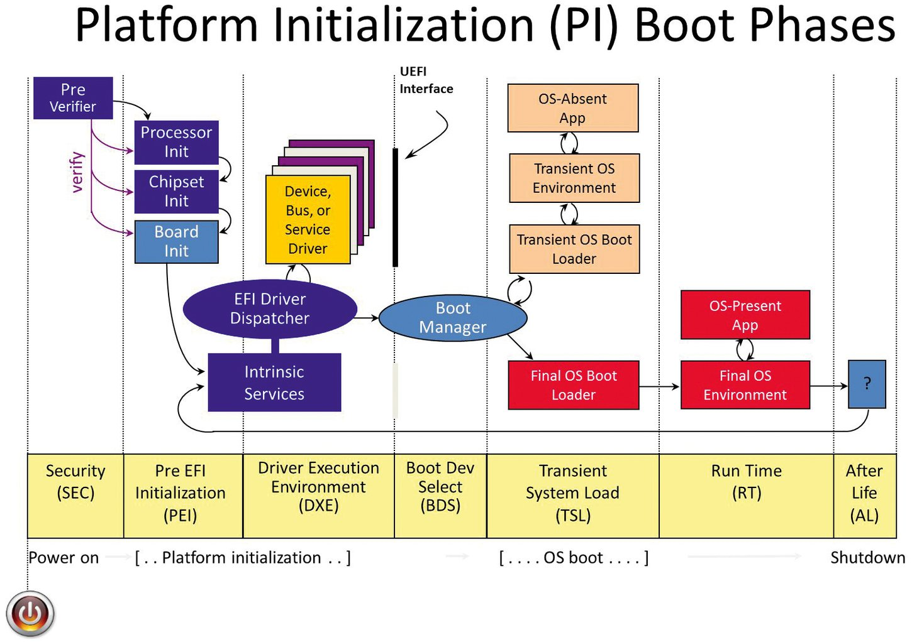

# QUICK HACK GNU EFI
* [GNU EFI](https://wiki.osdev.org/GNU-EFI)

GNU EFI is a very lightweight developing environment to create
UEFI applications. EDK2 is a large, complex environment with
its own build system. GNU EFI on the other hand is a set of
libraries and headers for compiling UEFI applications with a
system's native GCC.

ACPI defines platform-independent interfaces for hardware
discovery, configuration, power management and monitoring, and
these tables contain lots of useful information for low-level
programmers.

### Abstract

This repo is intended to deal with the INTEL BSPs. The 99% of
which are based upon UEFI bootloader. This one is using GPT,
NOT legacy lookalike BIOS (MBR of 512 bytes, the zero sector
with up to three Primary and one Extended partitions.

Legacy UEFI one is also called CSM (Compatibility Support Mode).

GPT (General Partitioning Table) has 128 boot entries.

GNU EFI repo is intended to start exploring UEFI ACPI tables.
Here is the UEFI architecture shown.

Since I intend to do indepth exploration of INTEL IOT BSP,
I still decided to leave a quick hack initial GNU EFI repo
(gnu-efi repo) as a Public repo.

## List ACPI Tables From UEFI Shell
* [List ACPI Tables From UEFI Shell](https://blog.fpmurphy.com/2015/01/list-acpi-tables-from-uefi-shell.html)

A tiny utility to list out the firmware Advanced Configuration
and Power Interface (ACPI) tables.

* [Advanced Configuration and Power Interface](https://en.wikipedia.org/wiki/ACPI)

For UEFI utility development, Nigel Croxon’s gnu-efi library
is used.

* [Nigel Croxon’s gnu-efi library](https://sourceforge.net/projects/gnu-efi)

## Content

	1 Basic Concept
	2 Requirements
		2.1 Install gnu-efi package
		2.2 Install Nigel Croxon’s gnu-efi libraries
		2.3 Config Nigel Croxon’s gnu-efi headers
			2.31 Headers using host /usr/include/efi
			2.32 Headers using the EDK2 package
			2.33 Headers using the minimal headers from GNU EFI inc/
		2.4 Linker Script
	3 Creating an EFI executable
		3.1 Compilation
		3.2 Linking
		3.3 Converting Shared Object to EFI executable
	4 Calling Any Arbitrary UEFI Function

### [1] Basic Concept

The main concept is to use your host native compiler, then
convert the resulting ELF into UEFI compatible PE. This means
you can use your native toolchain, and only one additional
step is required.

Of course you can also use GCC Cross-Compiler generating PE
directly as described in UEFI App Bare Bones. Whichever you
prefer.

### [2] Requirements

#### [2.1] Install gnu-efi (I use Fedora 39) package

	$ sudo dnf install gnu-efi

	Package gnu-efi-1:3.0.11-14.fc39.x86_64 is already installed.
	Dependencies resolved.
	Nothing to do.

#### [2.2] Download and compile Nigel Croxon’s gnu-efi library

Download and compile Nigel Croxon’s gnu-efi library:

	### Download Nigel Croxon’s gnu-efi library and create the home directory
	$ https://sourceforge.net/projects/gnu-efi/files/latest/download
	$ cp ~/Downloads/gnu-efi-3.0.17.tar.bz2 /home/vuser/projects/github/gnu-efi/

	### Untar the Nigel Croxon’s gnu-efi library
	$ tar -xjvf gnu-efi-3.0.17.tar.bz2

	$ cd gnu-efi-3.0.17

	### Make the UEFI compliable/linkable environment
	$ make

This "make" should create the following three object files:

	- crt0-efi-x86_64.o: A CRT0 (C runtime initialization code) that will call the
	  "efi_main" function
	- libgnuefi.a: A library containing a single function (_relocate) that is used by
	  the CRT0
	- libefi.a: A library containing convenience functions like CRC computation,
	  string length calculation, and easy text printing

Strictly speaking only the first two are needed, but it is worth
having the third.

#### [2.3] Config Nigel Croxon’s gnu-efi headers

##### [2.31] Headers using host /usr/include/efi

You'll need some header files. You can use the ones shipped
with your Linux distribution (/usr/include/efi), this is the
preferable as they are updated to the latest (if they do
exist?! In the distro used).

CONTRA: systems and user spaces files are interleaved, this
is NOT ACCEPTABLE! Used as method in the original example.

The original [2.31] Makefile from:
* [List ACPI Tables From UEFI Shell](https://blog.fpmurphy.com/2015/01/list-acpi-tables-from-uefi-shell.html)

Can be found in the root of the gnu-efi repo.

##### [2.32] Headers using the EDK2 package

You can use headers from the EDK2 package.

[?] NOT enough explored. To be further investigated.

##### [2.33] Headers using the minimal headers in from EFI inc/

You can use the minimal headers in from EFI inc. From:

	.../gnu-efi/gnu-efi-3.0.17/inc

PRO: I used this approach. Kept all as much as I can in user
space. As a true PRO approach.

Remember a Latin ProVerb: "Divide and Concuer"? Here implemented.

For this I needed to rewrite [2.31] original Makefile to support
modified [2.33] Makefile (NOT presented here). To fully achieve
"Divide and Concuer" approach!

### [3] Creating an EFI executable

	3.1 Compilation
	3.2 Linkage
	3.3 Shared Objects Conversion to the EFI executable

Please, could you explore the mockup Makefile used @:

	./gnu-efi-3.0.17/Makefile

#### 3.1 Compilation

Real listacpi compilation .o example

%.o: %.c

	$(CC) -I /home/vuser/projects/github/gnu-uefi/gnu-efi-3.0.17/inc \
	-ffreestanding -fno-stack-protector -fno-stack-check -fshort-wchar \
	-fPIC -mno-red-zone -maccumulate-outgoing-args -c listacpi.c -o listacpi.o

#### 3.2 Linkage

Real listacpi linking .so example

%.so: %.o

	$(LD) -shared -Bsymbolic -L/home/vuser/projects/github/gnu-uefi/gnu-efi-3.0.17/x86_64/lib \
	-L/home/vuser/projects/github/gnu-uefi/gnu-efi-3.0.17/x86_64/gnuefi \
	-T/home/vuser/projects/github/gnu-uefi/gnu-efi-3.0.17/gnuefi/elf_x86_64_efi.lds \
	/home/vuser/projects/github/gnu-uefi/gnu-efi-3.0.17/x86_64/gnuefi/crt0-efi-x86_64.o \
	listacpi.o -o listacpi.so -lgnuefi -lefi

#### 3.3 Shared Objects Conversion to the EFI executable

Real listacpi converting to .efi executable

%.efi : %.so

	$(OBJCOPY) -j .text -j .sdata -j .data -j .rodata -j .dynamic -j .dynsym  -j .rel -j .rela -j \
	.rel.* -j .rela.* -j .reloc --target efi-app-x86_64 --subsystem=10 listacpi.so listacpi.efi

### HOMEWORK

To use the original Chapter [2.31] relative paths Makefile using
host /usr/include/efi/ headers for the creation of the [2.33]
relative paths Makefile using the minimal headers from GNU
EFI inc/ .

	~/projects/github/gnu-efi$ ls -al
	total 412
	drwxr-xr-x.  4 vuser vusers   4096 Mar  8 16:52 .
	drwxr-xr-x. 54 vuser vusers   4096 Mar  8 12:24 ..
	-rw-r--r--.  1 vuser vusers   5161 Mar  8 12:24 arm_dts_vs_intel_acpi.md
	-rw-r--r--.  1 vuser vusers 208724 Mar  8 12:24 Boot_Phases.jpg
	drwxr-xr-x.  3 vuser vusers   4096 Mar  9 00:33 efi-example
	drwxr-xr-x.  8 vuser vusers   4096 Mar  8 13:29 .git
	-rw-r--r--.  1 vuser vusers    430 Mar  8 12:24 .gitignore
	-rw-r--r--.  1 vuser vusers 165568 Mar  8 13:19 gnu-efi-3.0.17.tar.bz2
	-rw-r--r--.  1 vuser vusers   1076 Mar  8 12:24 LICENSE
	-rw-r--r--.  1 vuser vusers   1722 Mar  8 18:02 Makefile <<===== [2.31] relative paths Makefile
	-rw-r--r--.  1 vuser vusers   6346 Mar  9 00:48 README.md

