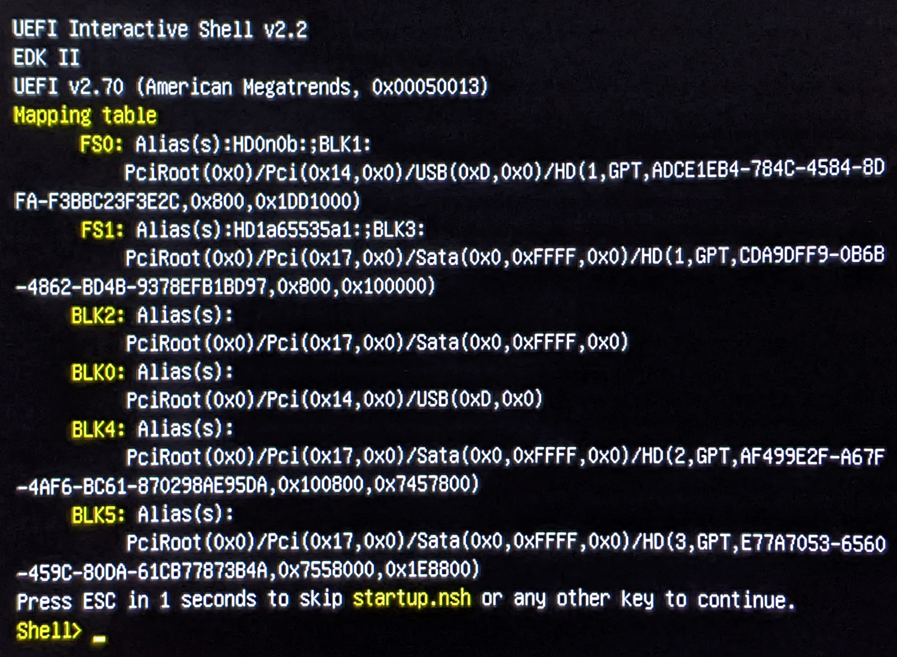
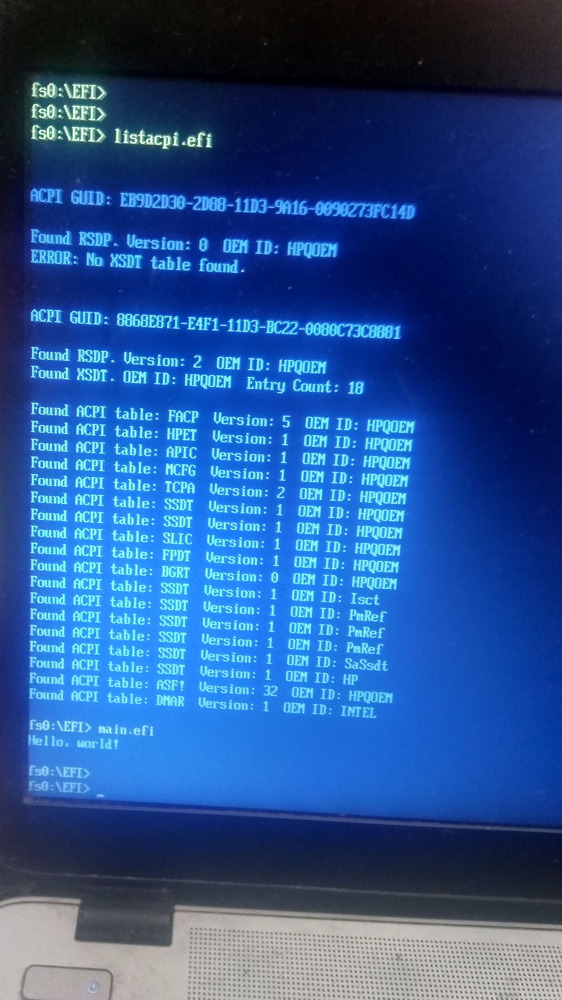

# Install GNU EFI environment in 5 easy steps

## Summary of the steps

After cloning the gnu-efi git, the following steps are required!

	[1] ./gnu-efi$ tar -xjvf gnu-efi-3.0.17.tar.bz2
	[2] ./gnu-efi$ cd gnu-efi-3.0.17
	### Make the UEFI compatible/linkable environment
	[3] ./gnu-efi/gnu-efi-3.0.17$ make
	### Then get back to gnu-efi/efi-example directory
	[4] ./gnu-efi/gnu-efi-3.0.17$ cd ..
	### Make .efi executable
	[5] ./gnu-efi/gnu-efi-3.0.17$ make

THAT'S IT, FOLKS!

All this is outlined in the script: ./gnu-efi/install.sh

Further down, just some more detailed instructions.

## Install GNU EFI environment and make listacpi.efi

### Install gnu-efi (I use Fedora 39) package

	### Fedora
	$ sudo dnf install gnu-efi

	Package gnu-efi-1:3.0.11-14.fc39.x86_64 is already installed.
	Dependencies resolved.
	Nothing to do.
or
	### Debian & Ubuntu
	$ sudo apt install gnu-efi

### Download and compile Nigel Croxon’s gnu-efi library

Download and compile Nigel Croxon’s gnu-efi library:

	### Download Nigel Croxon’s gnu-efi library and create the home directory
	### From the browser to ~/Downlosd/
	https://sourceforge.net/projects/gnu-efi/files/latest/download

	~$ cp ~/Downloads/gnu-efi-3.0.17.tar.bz2 ./gnu-efi

	### Untar the Nigel Croxon’s gnu-efi library
	./gnu-efi$ tar -xjvf gnu-efi-3.0.17.tar.bz2

	./gnu-efi$ cd gnu-efi-3.0.17

	### Make the UEFI compliable/linkable environment
	./gnu-efi/gnu-efi-3.0.17$ make

	### Then get back to ap directory
	./gnu-efi/gnu-efi-3.0.17$ cd ..

### Headers using the minimal headers in from gnu-efi-3.0.17/ inc/

	./gnu-efi/gnu-efi-3.0.17/inc

### Creating an EFI executable

Please, execute makefile as:

	./gnu-efi/gnu-efi-3.0.17$ make clean
	./gnu-efi/gnu-efi-3.0.17$ make

### After creating an EFI executable

You will find listacpi.elf in the ./gnu-efi :

	./gnu-efi$ ls -al
	total 424
	drwxr-xr-x.  4 vuser vusers   4096 Mar 10 15:08 .
	drwxr-xr-x. 56 vuser vusers   4096 Mar 10 14:26 ..
	-rw-r--r--.  1 vuser vusers   5161 Mar  8 12:24 arm_dts_vs_intel_acpi.md
	-rw-r--r--.  1 vuser vusers 208724 Mar  8 12:24 Boot_Phases.jpg
	drwxr-xr-x.  2 vuser vusers   4096 Mar 10 15:08 efi-example
	drwxr-xr-x.  8 vuser vusers   4096 Mar 10 16:15 .git
	-rw-r--r--.  1 vuser vusers    430 Mar  8 12:24 .gitignore
	-rw-r--r--.  1 vuser vusers 165568 Mar  8 13:19 gnu-efi-3.0.17.tar.bz2
	-rwxr-xr-x.  1 vuser vusers   1082 Mar 10 15:08 install.sh
	-rw-r--r--.  1 vuser vusers   1076 Mar  8 12:24 LICENSE
	-rw-r--r--.  1 vuser vusers   4167 Mar 10 14:18 listacpi.c
	-rwxr-xr-x.  1 vuser vusers  50380 Mar 10 14:26 listacpi.efi	<<===== .efi exe
	-rw-r--r--.  1 vuser vusers    877 Mar 10 14:44 Makefile	<<===== mockup Makefile
	-rw-r--r--.  1 vuser vusers   7031 Mar 10 16:27 README.md

Please, do not forget to use sudo (to be root as following these
instructions).

Please, copy listacpi.elf to the /dev/sda2 (which supposed to be
mounted on /boot/efi/).

	./gnu-efi$ sudo cp ./listacpi.elf /boot/efi/EFI

### Reboot the PC

You should have bootable EFI Shell USB Stick ready, and you
should boot from it:

* [EFI Shell USB Stick](https://www.thomas-krenn.com/de/wiki/EFI_Shell_USB_Stick)

Please,	reboot and boot to the bootable EFI Shell USB Stick.

Once you booted from the bootable EFI Shell USB Stick, you
should automatically stop in EFI Shell.

Use EFI Shell help to continue to the listacpi.elf execution.

	Shell> fs0:
	fs0:\>

	### Since you are at the root/mount point /boot/efi/
	fs0:\> cd EFI
	fs0:\EFI> ls
	directory of: fs0:\EFI
	...
	fs0:\EFI> listacpi.efi

For my HP EliteBook 840 notebook the output is the following:

(ACPI Tables listed, to be explored in The Future)

### HOMEWORK

To use the original Chapter [2.31] relative paths Makefile using
host /usr/include/efi/ headers for the creation of the [2.33]
relative paths Makefile using the minimal headers from GNU
EFI inc/ .

Happy efi shell-ing!

